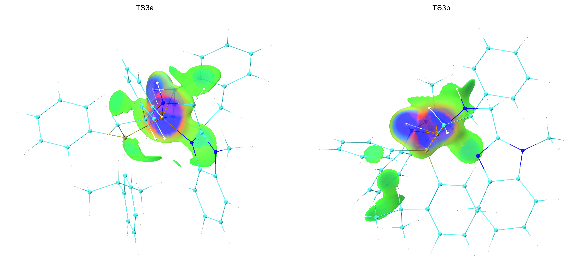

# IGMH Analysis Workflow

[](https://github.com/linlkx0810-svg/IGMH-Analysis-Workflow/actions/workflows/python-tests.yml)



This repository documents a reproducible workflow for **IGMH (Independent Gradient Model based on Hirshfeld partition)** analysis from Gaussian formatted checkpoint files and clean molecular visualization with **Multiwfn** and **VMD/Tachyon**.

The numerical workflow is generalizable. The bundled camera, panel crop, and screen-translation settings are optimized for the `TS3a`/`TS3b` example and may require adjustment for other molecular systems.

## Scope

```text
Gaussian .fchk -> Multiwfn IGMH cubes -> VMD/Tachyon rendering -> clean comparison figure
```

`run_workflow.py` does not calculate, regenerate, interpolate, or modify molecular structures. It checks input files, launches Multiwfn, launches VMD/Tachyon, converts rendered images, and combines panels.

## Requirements

- Python >= 3.10
- Multiwfn
- VMD with Tachyon
- Pillow, installed with `pip install -r requirements.txt`

## Tested Environment

This example workflow was tested with:

- OS: Windows 11 64-bit (system reports Windows NT 10.0.26200, x64)
- Python: 3.12.13
- Multiwfn: 2026.1.12, release date: 2026-Jan-12
- VMD: 1.9.4a53 for WIN64, release date: 2021-Jun-29
- Pillow: 12.3.0

The Multiwfn version above was taken from the generated `TS3b_Multiwfn_output.log` banner:

```text
Multiwfn -- A Multifunctional Wavefunction Analyzer
Version 2026.1.12, release date: 2026-Jan-12
Multiwfn official website: http://sobereva.com/multiwfn
```

Multiwfn development builds change frequently. When adapting this workflow, record the exact version and update/release date from your own Multiwfn banner or log.

## Quick Start

1. Put Gaussian formatted checkpoint files in `input/`:

```text
input/TS3a_SP_PCM.fchk
input/TS3b_SP_PCM.fchk
```

2. Install Python dependencies:

```bash
pip install -r requirements.txt
```

3. Make sure `Multiwfn` and `vmd` are available in your terminal `PATH`, or pass explicit executable paths.

4. Run:

```bash
python run_workflow.py
```

Default fragment definitions for the example:

```text
TS3a:
Fragment 1 = atoms 1-72
Fragment 2 = atoms 73-94

TS3b:
Fragment 1 = atoms 1-72
Fragment 2 = atoms 73-94
```

Default visualization settings:

```text
Quantity visualized: delta-g_inter
Initial delta-g_inter isovalue: 0.005 a.u.
Surface coloring: sign(lambda2)rho
Example shared sign(lambda2)rho range: -0.05 to +0.05 a.u.
Blue = attractive
Green = weak / van der Waals
Red = repulsive / steric
```

## Outputs

Individual clean panels:

```text
figures/TS3a_IGMH_clean.png
figures/TS3b_IGMH_clean.png
```

Combined clean comparison with no text:

```text
figures/TS3a_vs_TS3b_IGMH_clean.png
```

Combined comparison with only panel titles:

```text
figures/TS3a_vs_TS3b_IGMH_labeled.png
```

Multiwfn numerical outputs, cube files, and logs:

```text
output/TS3a_IGMH_files/
output/TS3b_IGMH_files/
```

Large numerical files such as `.fchk`, `.cub`, and logs are intentionally ignored by Git.

## Custom Fragments

Use the same fragment definition for all systems:

```bash
python run_workflow.py --fragment1 1-72 --fragment2 73-94
```

Or customize fragments separately by editing `parameters/fragments.csv`:

```csv
system,fragment1,fragment2,center_selection
TS3a,1-72,73-94,
TS3b,1-72,73-94,
```

Then run:

```bash
python run_workflow.py --fragments-file parameters/fragments.csv
```

The optional `center_selection` column is passed to VMD and is used only for render centering. Multiwfn atom ranges are one-based, while VMD `index` selections are zero-based.

To center each rendering on fragment 1 plus fragment 2 when `center_selection` is blank:

```bash
python run_workflow.py --fragments-file parameters/fragments.csv --auto-center-fragments
```

## Running from Existing Cubes

To render existing Multiwfn cube files without rerunning Multiwfn:

```bash
python run_workflow.py --skip-multiwfn
```

To dry-run the external commands first:

```bash
python run_workflow.py --dry-run
```

To use explicit executable paths:

```bash
python run_workflow.py --multiwfn "C:/path/to/Multiwfn.exe" --vmd "C:/path/to/vmd.exe"
```

## Multiwfn Menu Sequence

The default menu input in `run_workflow.py` and `parameters/multiwfn_igmh_interfragment.inp` is a hard-coded sequence for the TS3a/TS3b IGMH interfragment example. It was audited against the local `TS3b_Multiwfn_output.log` generated by Multiwfn 2026.1.12.

| Input | Meaning observed in the Multiwfn log |
| --- | --- |
| `20` | Main menu: `Visual study of weak interaction` |
| `11` | Weak-interaction menu: `IGMH: IGM analysis based on Hirshfeld partition of molecular density` |
| `2` | Number of fragments to define |
| `fragment1` | Atom indices for fragment 1, e.g. `1-72` |
| `fragment2` | Atom indices for fragment 2, e.g. `73-94` |
| `11` | Grid setup method: select atoms, set extension distance around them, and set grid spacing |
| `fragment2` | Atoms used to define the grid region |
| `3 A` | Extension distance around the selected atoms, in Angstrom |
| `0.15` | Grid spacing in Bohr |
| `3` | Post-processing: output cube files to current folder |
| `2` | Post-processing: output scatter points to `output.txt` |
| `6` | Post-processing: evaluate atomic and atom-pair delta-g indices and IBSIW |
| `2` | Integration grid quality: high quality, radial=40 and angular=170 |
| `y` | Output `atmdg.pdb` for the two fragments |
| `0` | Exit the IGMH post-processing menu |
| `0` | Return from the weak-interaction menu |
| `q` | Exit Multiwfn |

Do not assume these menu indices are stable across Multiwfn versions. If your Multiwfn menu layout differs, run Multiwfn interactively once, save the working menu sequence, and pass it with:

```bash
python run_workflow.py --multiwfn-input-template parameters/multiwfn_igmh_interfragment.inp
```

## Rendering Notes

The VMD/Tachyon rendering preset in `scripts/render_IGMH.tcl` uses:

```text
Per-panel image size: 2400 x 2400 px
Projection: Orthographic
delta-g_inter isovalue: 0.005 a.u.
sign(lambda2)rho color range: -0.05 to +0.05 a.u.
Molecular representation: CPK 0.500000 0.170000 32.000000 28.000000
IGMH material opacity: 0.60
Background: white
```

For other systems, keep the numerical settings consistent between compared structures, but adjust the camera and crop only as needed for a clear view.

## Limitations

- Multiwfn menu indices may change between versions or builds.
- The bundled camera, translation, scale, and crop parameters are specific to the TS3a/TS3b example.
- IGMH visualization does not provide interaction energies and should not be used alone to establish relative transition-state stability.

## Recommended Output Structure

```text
IGMH-Analysis-Workflow/
|-- input/
|   |-- TS3a_SP_PCM.fchk
|   `-- TS3b_SP_PCM.fchk
|-- output/
|   |-- TS3a_IGMH_files/
|   `-- TS3b_IGMH_files/
|-- parameters/
|   |-- fragments.csv
|   |-- IGMH_parameters.txt
|   `-- multiwfn_igmh_interfragment.inp
|-- scripts/
|   `-- render_IGMH.tcl
|-- figures/
|   |-- TS3a_IGMH_clean.png
|   |-- TS3b_IGMH_clean.png
|   |-- TS3a_vs_TS3b_IGMH_clean.png
|   `-- TS3a_vs_TS3b_IGMH_labeled.png
|-- analysis/
|   `-- example_key_contacts.csv
|-- tests/
|   `-- test_workflow.py
|-- run_workflow.py
|-- requirements.txt
|-- CITATION.cff
`-- README.md
```

## Analysis Folder

`analysis/example_key_contacts.csv` is an optional manually curated example of key contacts in the TS3a/TS3b case. It is **not** generated by `run_workflow.py`.

The main automated workflow is Multiwfn cube generation plus VMD/Tachyon clean rendering.

## Reproducibility Checklist

Before comparing structures, confirm that both use the same:

```text
[ ] fragment definitions
[ ] Multiwfn version and menu sequence
[ ] IGMH analysis method
[ ] delta-g_inter isovalue
[ ] sign(lambda2)rho color range
[ ] grid settings
[ ] atom representation
[ ] sphere scale
[ ] bond radius
[ ] surface opacity
[ ] projection
[ ] visual scale
[ ] background
[ ] rendering resolution
```

## Example Data Provenance

The repository includes rendered TS3a/TS3b example figures to demonstrate the workflow. Raw `.fchk`, `.cub`, and Multiwfn log files are intentionally not distributed because they are large generated/research data files and may need to be regenerated or supplied locally by the user.

If you adapt this workflow for a published computational study, cite the original source of the molecular structures and quantum-chemical calculations in addition to citing Multiwfn, IGMH, and VMD.

## Scientific Interpretation

IGMH is a visualization and interaction-analysis method. The IGMH surface should not be treated as a direct interaction energy. Energetic preference between transition states should be established from quantum-chemical energy or free-energy calculations; IGMH can then help rationalize attractive contacts, dispersion interactions, steric repulsion, and catalyst-substrate pocket complementarity.

## Citation

This repository includes a `CITATION.cff` file so GitHub can expose a "Cite this repository" panel. If you use this workflow, cite this repository and the underlying Multiwfn/IGMH/VMD methods.

Please cite the relevant third-party software and methods when using this workflow:

- Multiwfn software: T. Lu and F. Chen, "Multiwfn: A multifunctional wavefunction analyzer", *J. Comput. Chem.* **2012**, 33, 580-592. DOI: [10.1002/jcc.22885](https://doi.org/10.1002/jcc.22885).
- Multiwfn current overview: T. Lu, "A comprehensive electron wavefunction analysis toolbox for chemists, Multiwfn", *J. Chem. Phys.* **2024**, 161, 082503. DOI: [10.1063/5.0216272](https://doi.org/10.1063/5.0216272).
- IGMH method: T. Lu and Q. Chen, "Independent gradient model based on Hirshfeld partition: A new method for visual study of interactions in chemical systems", *J. Comput. Chem.* **2022**, 43, 539-555. DOI: [10.1002/jcc.26812](https://doi.org/10.1002/jcc.26812).
- VMD: W. Humphrey, A. Dalke and K. Schulten, "VMD: Visual molecular dynamics", *J. Mol. Graph.* **1996**, 14, 33-38. DOI: [10.1016/0263-7855(96)00018-5](https://doi.org/10.1016/0263-7855(96)00018-5).

Official Multiwfn website and documentation:

- [Multiwfn official website](http://sobereva.com/multiwfn/)
- [Multiwfn manual](http://sobereva.com/multiwfn/Multiwfn_manual.html)
- [Multiwfn mirror](https://www.umsyar.com/multiwfn/)

## License

The MIT license applies to the original scripts and documentation in this repository. Multiwfn and VMD are third-party software distributed under their own terms.

